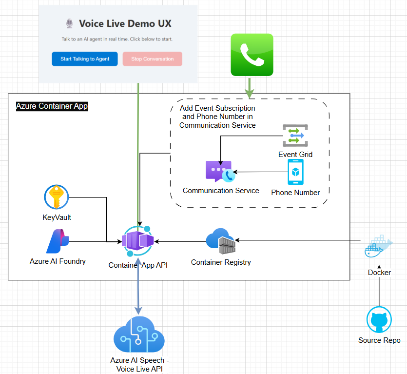

# Call Center Voice Agent Accelerator with Azure Voice Live API

Welcome to the *Call Center Real-time Voice Agent* solution accelerator. It's a lightweight template to create speech-to-speech voice agents that deliver personalized self-service experiences and natural-sounding voices, seamlessly integrated with telephony systems. This solution accelerator uses  **Azure Voice Live API** and **Azure Communication Services** — Start locally, deploy later to Azure Web App. No PSTN number needed.

The Azure voice live API is a solution enabling low-latency, high-quality speech to speech interactions for voice agents. The API is designed for developers seeking scalable and efficient voice-driven experiences as it eliminates the need to manually orchestrate multiple components. By integrating speech recognition, generative AI, and text to speech functionalities into a single, unified interface, it provides an end-to-end solution for creating seamless experiences. Learn more about [Azure Voice Live API](https://learn.microsoft.com/azure/ai-services/speech-service/voice-live).

The Azure Communication Services Calls Automation APIs provide telephony integration and real-time event triggers to perform actions based on custom business logic specific to their domain. Within the call automation APIs developers can use simple AI powered APIs, which can be used to play personalized greeting messages, recognize conversational voice inputs to gather information on contextual questions to drive a more self-service model with customers, use sentiment analysis to improve customer service overall. Learn more about [Azure Communication Services (Call Automation)](https://learn.microsoft.com/azure/communication-services/concepts/call-automation/call-automation).


<br/>

<div align="center">

[**SOLUTION OVERVIEW**](#solution-overview) \| [**QUICK DEPLOY**](#quick-deploy) \| [**TESTING**](#testing-the-agent) \| [**TROUBLESHOOTING**](#troubleshooting) \| [**TEAM DEPLOYMENTS**](#team-deployments) \| [**RESOURCE CLEAN-UP**](#resource-clean-up)

</div>
<br/>

## Solution Overview
This sample demonstrates how to build a real-time voice agent using the [Azure Speech Voice Live API](https://learn.microsoft.com/azure/ai-services/speech-service/voice-live).

The solution includes:
- A backend service that connects to the **Voice Live API** for real-time ASR, LLM and TTS
- Two client options: **Web browser** (microphone/speaker) and **Azure Communication Services (ACS)** phone calls
- Flexible configuration to customize prompts, ASR, TTS, and behavior
- Easy extension to other client types such as [Audiohook](https://learn.microsoft.com/azure/ai-services/speech-service/how-to-use-audiohook)

> You can also try the Voice Live API via [Azure AI Foundry](https://ai.azure.com/foundry) for quick experimentation before deploying this template to your own Azure subscription.

### Architecture diagram
||
|---|

<br/>

## Quick Deploy

### Prerequisites and Costs
To deploy this solution accelerator, ensure you have access to an [Azure subscription](https://azure.microsoft.com/free/) with the necessary permissions to create **resource groups and resources**. Follow the steps in [Azure Account Set Up](./docs/AzureAccountSetUp.md).

Check the [Azure Products by Region](https://azure.microsoft.com/explore/global-infrastructure/products-by-region/table) page and select a **region** where the following services are available: Azure AI Foundry Speech, Azure Communication Services, Azure Container Apps, and Container Registry.

Here are some example regions where the services are available: East US2, West US2, Southeast Asia, Central India, Sweden Central.
Pricing varies per region and usage, so it isn't possible to predict exact costs for your usage. The majority of the Azure resources used in this infrastructure are on usage-based pricing tiers. However, Azure Container Registry has a fixed cost per registry per day.

Use the [Azure pricing calculator](https://azure.microsoft.com/en-us/pricing/calculator) to calculate the cost of this solution in your subscription.

| Product | Description | Cost |
|---|---|---|
| [Azure Speech Voice Live ](https://learn.microsoft.com/azure/ai-services/speech-service/voice-live/) | Low-latency and high-quality speech to speech interactions | [Pricing](https://azure.microsoft.com/pricing/details/cognitive-services/speech-services/) |
| [Azure Communication Services](https://learn.microsoft.com/azure/communication-services/overview) | Server-based intelligent call workflows | [Pricing](https://azure.microsoft.com/pricing/details/communication-services/) |
| [Azure Container Apps](https://learn.microsoft.com/azure/container-apps/) | Hosts the web application frontend | [Pricing](https://azure.microsoft.com/pricing/details/container-apps/) |
| [Azure Container Registry](https://learn.microsoft.com/azure/container-registry/) | Stores container images for deployment | [Pricing](https://azure.microsoft.com/pricing/details/container-registry/) |


Here are some developers tools to set up as prerequisites:
- [Azure CLI](https://learn.microsoft.com/cli/azure/what-is-azure-cli): `az`
- [Azure Developer CLI](https://learn.microsoft.com/azure/developer/azure-developer-cli/overview): `azd`
- [Python](https://www.python.org/about/gettingstarted/): `python`
- [UV](https://docs.astral.sh/uv/getting-started/installation/): `uv`
- Optionally [Docker](https://www.docker.com/get-started/): `docker`

<br/>

### Deployment and setup
1. Sign up for a [free Azure account](https://azure.microsoft.com/free/) and create an Azure Subscription.

2. Login to Azure:

    ```shell
    azd auth login
    ```

3. Provision and deploy all the resources:

    ```shell
    azd up
    ```
    It will prompt you to provide an `azd` environment name (like "flask-app"), select a subscription from your Azure account, and select a location (like "eastus"). Then it will provision the resources in your account and deploy the latest code. If you get an error with deployment, changing the location can help, as there may be availability constraints for some of the resources.

4. When `azd` has finished deploying, you'll see an endpoint URI in the command output. Visit that URI, and you should see the API output! 🎉

5. When you've made any changes to the app code, you can just run:

    ```shell
    azd deploy
    ```

>[!NOTE]
>AZD will also setup the local Python environment for you, using `venv` and installing the required packages.


>[!NOTE]
>- Region: swedencentral is strongly recommended due to AI Foundry availability.
>- Post-Deployment: You can also setup ACS Event Grid subscription and PSTN to use the ACS client.

<br/>

## Testing the Agent

After deployment, you can verify that your Voice Agent is running correctly using either the Web Client (for quick testing) or the ACS Phone Client (for simulating a real-world call center scenario).

🌐 Web Client (Test Mode)

Use this browser-based client to confirm your Container App is up and responding.

1. Go to the [Azure Portal](https://portal.azure.com) and navigate to the **Resource Group** created by your deployment.
2. Find and open the **Container App** resource.
3. On the **Overview** page, copy the **Application URL**.
4. Open the URL in your browser — a demo webpage should load.
5. Click **Start Talking to Agent** to begin a voice session using your browser’s microphone and speaker.
6. Click **Stop Conversation** to end the session.

> ⚠️ This web client is intended for testing purposes only. Use the ACS client below for production-like call flow testing.


📞 ACS Client (Call Center Scenario)

This simulates a real inbound phone call to your voice agent using **Azure Communication Services (ACS)**.


#### 1. Set Up Incoming Call Webhook

1. In the same resource group, find and open the **Communication Services** resource.
2. In the left-hand menu, click **Events**.
3. Click **+ Event Subscription** and fill in the following:

   - **Event Type**: `IncomingCall`
   - **Endpoint Type**: `Web Hook`
   - **Endpoint Address**:
     ```
     https://<your-container-app-url>/acs/incomingcall
     ```
     Replace `<your-container-app-url>` with the Application URL from your Container App.

📸 Refer to the screenshot below for guidance:


#### 2. Get a Phone Number

If you haven't already, obtain a phone number for your ACS resource:

👉 [How to get a phone number (Microsoft Docs)](https://learn.microsoft.com/azure/communication-services/quickstarts/telephony/get-phone-number?tabs=windows&pivots=platform-azp-new)


#### 3. Call the Agent

Once your event subscription is configured and the phone number is active:

- Dial the ACS number.
- Your call will connect to the real-time voice agent powered by Azure Voice Live.


#### Local execution

Once the environment has been deployed with `azd up` you can also run the application locally.

Please follow the instructions in [the instructions in `service`](./service/README.md)
Instead use the [`server`](./server/README.md) directory for local execution details.

<br/>

## Troubleshooting

Common deployment issues and how to resolve them.

### 1. Container image error: MANIFEST_UNKNOWN
**Error (excerpt):**
```
Field 'template.containers.main.image' ... MANIFEST_UNKNOWN: manifest tagged by "latest" is not found
```
**Cause:** The Bicep template falls back to a hard-coded image tag `voice-live-agent/app-voiceagent:latest` in your Azure Container Registry (ACR). That repository:tag wasn't pushed yet, so the first Container App revision fails.

**Fix Options:**
- Build & push the expected image:
    ```bash
    az acr build -r <REGISTRY_NAME> -t voice-live-agent/app-voiceagent:latest ./server
    ```
- Or change the image reference (parameterize in Bicep) to a tag that exists.

**Validate:**
```bash
az acr repository show-manifests -n <REGISTRY_NAME> --repository voice-live-agent/app-voiceagent -o table
```

### 2. azd deploy error: could not determine container registry endpoint
**Error:**
```
failed deploying service 'app': could not determine container registry endpoint
```
**Cause:** Environment variable `AZURE_CONTAINER_REGISTRY_ENDPOINT` was never populated (initial `azd up` failed before outputs were written).

**Fix:** Set it manually or re-run provisioning.
```bash
azd env set AZURE_CONTAINER_REGISTRY_ENDPOINT <REGISTRY_NAME>.azurecr.io
azd deploy
```
Or refresh infra outputs:
```bash
azd provision
```

### 3. azd deploy error: getting latest revision name: %!w(<nil>)
**Cause:** A formatting bug surfaced when the Container App had no successful revision (previous image pull failure). azd could not resolve a latest revision.

**Fix Options:**
```bash
# Force a new revision with a valid image
az containerapp update -g <RESOURCE_GROUP> -n <APP_NAME> \
    --image <REGISTRY_NAME>.azurecr.io/voice-live-agent/app-voiceagent:latest

# If still failing, delete and let azd recreate
az containerapp delete -g <RESOURCE_GROUP> -n <APP_NAME> --yes
azd deploy
```

### 4. Confirm Container App revisions
```bash
az containerapp revision list -g <RESOURCE_GROUP> -n <APP_NAME> -o table
```
Look for a revision in `Active` state. If only `Failed` revisions exist, fix the image/tag and redeploy.

### 5. Check registry permissions (AcrPull)
Ensure the user-assigned identity attached to the Container App has `AcrPull` on the registry:
```bash
REG_ID=$(az acr show -n <REGISTRY_NAME> --query id -o tsv)
az role assignment list --scope $REG_ID -o table | grep AcrPull || echo "Missing AcrPull"
```
Add if missing:
```bash
az role assignment create --assignee <IDENTITY_PRINCIPAL_ID> --scope $REG_ID --role AcrPull
```

### 6. Parameterizing the image (recommended improvement)
Instead of a hard-coded fallback, add a Bicep parameter (example sketch):
```bicep
@description('Full container image (registry/repository:tag).')
param containerImage string = ''
// inside container definition
image: empty(containerImage) ? (fetchLatestImage.outputs.containers[0]?.image ?? '') : containerImage
```
Then set it via environment variable mapping or `azd env set`.

---

## Team Deployments

To let teammates deploy to the same already-provisioned resource group without sharing your local `.azure` folder (never commit it):

### 1. Grant Access
Assign at least `Contributor` role on the resource group (and optionally `AcrPush` if they will build images).

### 2. Teammate Local Setup
```bash
git clone <repo-url>
cd call-center-voice-agent-accelerator-hackathon
azd auth login
az account set --subscription <SUB_ID>
azd env new <EXISTING_ENV_NAME> --subscription <SUB_ID> --location <LOCATION>
azd env refresh   # pulls outputs (ACR endpoint, etc.) from existing deployment
```

### 3. Deploy Application Code Only
```bash
azd deploy
```
Use `azd provision` only when infrastructure (Bicep) changes are merged.

### 4. Environment Variables
If a value is missing (e.g., `AZURE_CONTAINER_REGISTRY_ENDPOINT`), run:
```bash
azd env set AZURE_CONTAINER_REGISTRY_ENDPOINT <REGISTRY_NAME>.azurecr.io
```

### 5. Best Practices
- Do NOT commit `.azure/`.
- Provide an example file (e.g., `.azure/env.example`) listing expected variable names (no secrets).
- Use CI/CD with a service principal for production deployments.

---

## Resource Clean-up

When you no longer need the resources created in this article, run the following command to power down the app:

```bash
azd down
```

If you want to redeploy to a different region, delete the `.azure` directory before running `azd up` again. In a more advanced scenario, you could selectively edit files within the `.azure` directory to change the region.

<br/>

## Contributing

This project welcomes contributions and suggestions. Please see [CONTRIBUTING.md](CONTRIBUTING.md) for details.

<br/>

## License

This project is licensed under the MIT License. See [LICENSE.md](LICENSE.md) for details.
